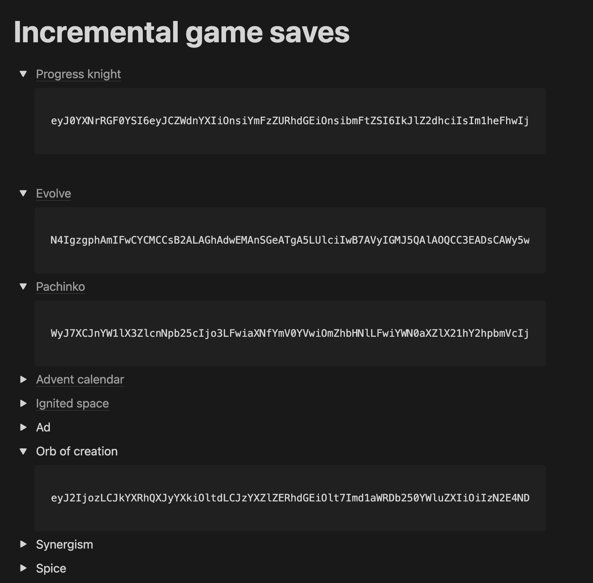
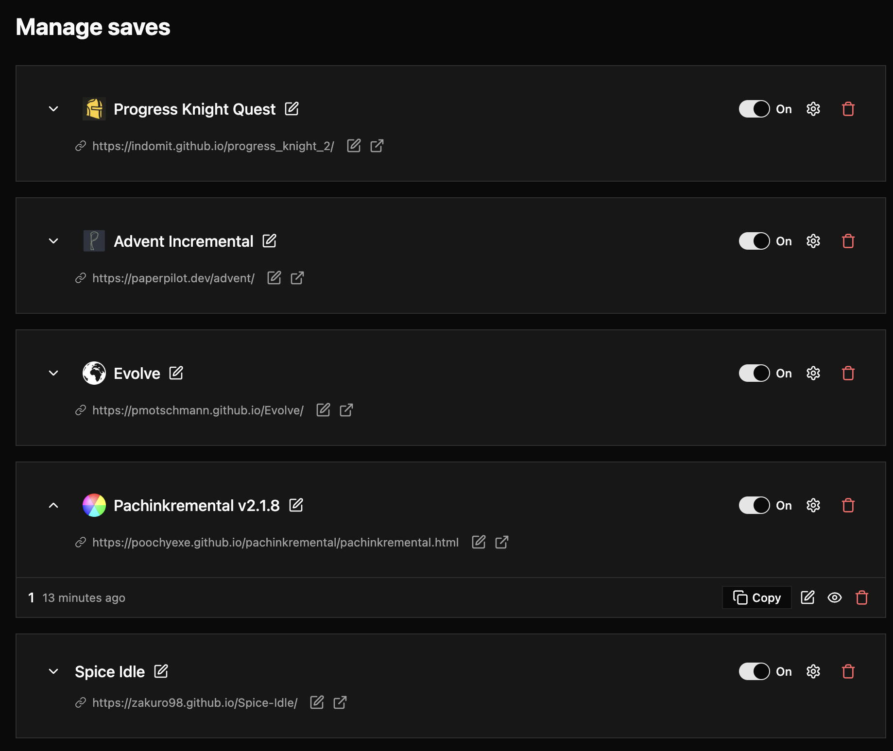

# Idle Save Manager

If you are like me, you kept a list of all the idle games that you are playing somewhere with their respective save files, which would look something like this:

This would work, but is a bit tedious, so I made a small extension that keeps your game links and saves in order:

## Supported games

This extension will work with any game that allows you to copy your save data into clipboard, including, but not limited to fan favorites like:

- [Evolve](https://github.com/pmotschmann/Evolve)
- [Pachinkremental](https://poochyexe.github.io/pachinkremental/pachinkremental.html)
- [Spice idle](https://zakuro98.github.io/Spice-Idle/)
- [Shark incremental](https://mrredshark77.github.io/shark-incremental/)
- [Progress knight 2](https://indomit.github.io/progress_knight_2/)
- [Advent incremental](https://paperpilot.dev/advent/)
- [CityInc](http://cityinc.se/)

## License

MIT
